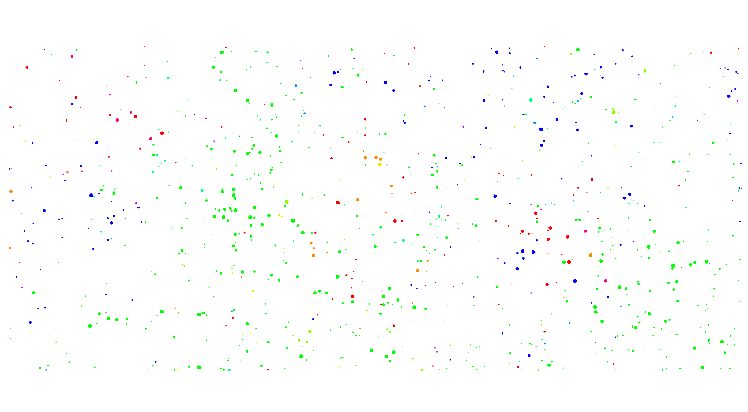
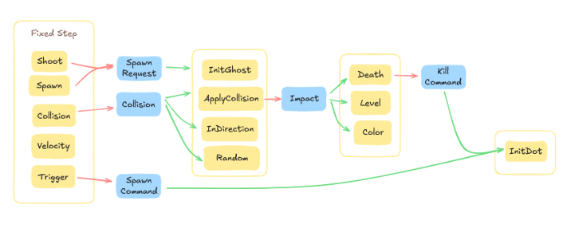
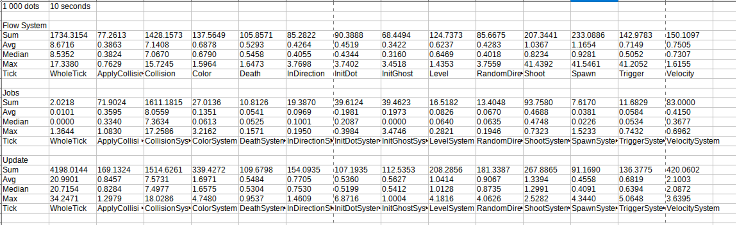

# Unity ECS DOTS Simulation Documentation

## TLDR

### Goal & Purpose

* Created to experiment with various data-oriented design approaches within Unity’s ECS framework
* Focused on evaluating performance, chunk-based architecture, and scalable agent simulation
* Serves as a prototype for testing and comparing ECS implementation strategies and system variants

## Simulation Concept

* Agents called “dots” move, shoot, and interact based on color and size
* Larger dots “eat” smaller same-color dots for XP; different-color collisions cause damage
* Colors mix on collision
* XP = Health, and size increases with XP

## Simulation Architecture

### Ghosts

Ghosts are a placeholder inside the physics world to verify upfront if the the spot the dot wants to spawn in is blocked. Using extra ghost entities for that in theory also allows to later on extend this behaviour by letting dots spawn with a cooldown or protection so they can’t be damaged right away.

### Dots

The game architecture centers around autonomous entities called dots, which serve as the core actors in a dynamic, emergent environment. Each dot is governed by modular behavior systems that determine how it interacts with the world. Dots navigate the world using strategy-based targeting: they select a target based on conditions (e.g., direction, proximity, or player), then move toward it. The architecture is designed to allow for highly customizable strategies so that different types of entities can behave differently within the same framework.

### Dot Components

From Unity: URPMaterialPropertyBaseColor, LocalTransform, Physics related components
Mine: DotTag, DirectionComponent, RGBComponent, LevelComponent, TargetStrategyComponent, TargetComponent, ShootTimeComponent, CollidedComponent, XPComponent, TeamComponent (color)

### XP/Health/Leveling

One of the central mechanics designed into this architecture is the concept of XP-based interaction. Dots can absorb smaller dots of the same color and smaller size to gain XP and grow, effectively “leveling up” over time. Conversely, dots take damage (a loss of XP) when they collide with dots of a different color and different size. This simplifies the design by merging health and XP into a single value that governs both survival and progression. The size of a dot is directly tied to its XP, making size a visible indicator of power or survivability.

### Player

The player is implemented as a normal dot with its own movement strategy. It uses input controls passed from the MonoBehaviour world into the ECS world via a custom input bridge. Everything else about the player including XP, color, and interaction mechanics follows the same structure as other agents. This design ensures consistency in logic and keeps the architecture unified.

## System Flow

I decided for an event based design after testing different approaches for this architecture. This replaces the need of scheduling complex dependencies as each system knows themselves what it needs. The init ghost system can spawn ghosts when either shoot or spawn request it. It doesn’t need to know where a spawn is coming from. Even though I used different buffers there for parallelism convenience. Directions change every time the dot collides with anything. There might be more strategies in the future. Once the impact (damage, color) from the collision is assigned, death, level and color systems can update the dot entities only when needed. The DotInitSystem in the end gathers Spawn demands and kill commands and pools them together before adding structural changes.

## Performance

* Chunk Design: Not using shared components yet as I want to measure structural change costs vs. performance gain in the future. So far, I am avoiding structural changes when not necessary and am using pooling to reactivate disabled entities and even match spawn and kill commands with each other before disabling.
* Jobs: As this is clearly one of the bigger advantages in ECS, I want to make sure I use them correctly and am actually gaining performance. I am scheduling Parallel when it is useful but also run whole systems at the same time.
* Fixed Step: A lot of my logic is depending on physics and therefore I don’t need to run my systems every frame. I am thinking about increasing the step to update less often but that would require some interpolation entity to still ensure a good fluent framerate, so I will investigate how that looks. At the moment each of my systems only needs to update once in between each fixed step. So I have plenty of time to complete all my logic without forcing it into the fixed step itself.
* Frame distribution: Instead of running all my systems on one single frame, I distribute them based on their dependencies. This way I am avoiding dependency conflicts, run the system at the same time and could even run some in Update without needing to complete earlier jobs if that might be a better option
* Defer: I try deferring information as far back as I can. Usually that can be the end of the frame or sometimes I even write changes to the beginning ecb of the next fixed step. It is rarely needed to update everything immediately and this way, I am further reducing dependencies, can leave most of my data in read only and therefore avoid jobs waiting for each other.
* Cache: Making sure to always traverse in cache friendly ways and presorting entity specific impact data by entity.
* Blob Assets: Data that doesn’t need to be stored per dot, should live outside. In my case, I saved all level info outside and precalculated the impacts between each level upfront. This saves repetitive calculations but also ensures that entities don’t grow too large. That is not just a memory trade off, it also influences performance, as the cache can load fewer entities at once and chunks can store fewer entities inside.
* System Calls: Having additional checkpoints in between also offered the option to use event components instead of UpdateAfter or other dependency chaining. This way, Systems can register with RequireForUpdate to any event and avoid being called when it is not needed. I want to explore disabling unnecessary system calls even more in the future. I also like it when Systems don’t know about each other and only think about when they need to run. The event based structure supports this very well and gives Unity a lot of freedom to optimise everything that I pass over.
* One single System: I also investigated doing everything in one frame, having all on one system and passing all the jobhandles in the most efficient way. While the total duration from first job to the last is the fastest here, for now I am preferring the distribution event approach.
* IJob vs IJobFor: This is an area I still want to investigate more. For now, I used parallel jobs wherever possible.
* Complete(): For a bigger project it might hit limitations. But in my small one I managed to not complete any job nor playback an ecb. I fully trust Unity to run it when it is most convenient. I wish there was an „Update whenever during this frame“ ecb.
* Grid/Layouts: I think chunks could be a great way for smart Layout designs. I am not a fan of static cells. But I could totally see a polygon structure that represents regions with their connections to other regions. This could be used on top of that to provide some spacial reasoning awareness. Each region, connection or chokepoint could save the amount of entities killed there. If the structure is used as a NavMesh as well, it could even combine this information into pathfinding to not just find the fastest but also the safest route or plan a tactical manoeuvre. For my simulation, this is all overkill. But still fun to think about. If the connections between regions ensure capturing the closest distance between obstacles, the edge length could even be used to know which agent sizes fit through. If there are subregions, it could also be used for hierarchical pathfinding. Anyways, speaking of grids, I fully trust Unity Physics to internally optimize everything possible for collision and triggers. My own systems don’t need a layout yet. Might add that in the future.
* LOD: As this simulation has no player (there is one, but it is not really used as this is not a game), I didn’t integrate LOD yet. But I could totally see the advantage of using LOD to update entities in specific chunks/regions/grid cells with less frequent fixed steps and framerate, not rendering them at all etc. If it is distance based, it could totally use chunk components to measure the distance to player in a hierarchical way and not needing to do that per single entity. If I understood correctly, these components can update without causing any structural changes. And aligning regions/grids with chunks in that way, seems highly efficient.
* Buffers: When I was using ECS before, we always used entities and components to pass on data between systems. But Buffers seem way better/more efficient when it is information just for the frame and not needing an entity representation. They don’t require a structural change, but are tricky with threads.
* Shared components: I am open to explore them more and am sure the rechunking can do pure magic. I usually try to avoid it as much as I can though and didn’t need them yet. I need a good reason first. Might experiment with it when I have more movement strategies.
* Change filters: I am already using them and they work great, but would love to put them on the system level. Will see how that goes.
* Profiling: By actually measuring the times for jobs, I can easily compare different approaches with each other. In the following table, I compared Using one single system with dependency scheduling on one frame (Jobs Parallel) vs. The event multiframe approach in Jobs (Jobs Multiframe) vs Update (Update Multiframe). As you can see, most systems are the fastest using the events where their call can be avoided in a lot of cases. On the other hand, the single system is not bound by the checkpoints, distributing job chains and dependencies more efficiently and taking less time in total. On the downside, it is on one single frame, so lagging might still happen. A longer time distributed onto more frames is still my preferred option for now. I don’t like the single system solution. But I am very open to learn more about job scheduling in between systems and how to pass dependencies with either singletons, buffers or components.

## Systems

These core systems contain the core game logic and are executed in the main simulation loop. They are structured in folders according to which entities they run on or which topic they cover.

### DeathSystem

The DeathSystem is responsible for handling entity "death" behavior in the ECS-based game. It runs as part of Unity's simulation update loop and evaluates each entity that possesses an XPComponent to determine whether it should be considered "dead." This system checks if any entity's XP (experience which is same as health) has dropped to zero or below. If so, it writes into a buffer to kill it.

### VelocitySystem

The VelocitySystem handles movement for entities using Unity Physics by applying linear velocity based on direction and speed. It operates in the fixed update loop, ensuring consistency with the physics simulation. For each entity with a PhysicsVelocity, a DirectionComponent, and a SpeedGroupComponent, it calculates an impulse vector by multiplying the normalized direction with the entity's speed and a scaling factor. This impulse is then directly assigned to the linear velocity, determining the entity’s movement for the physics engine. Although currently the system overwrites velocity directly, potential future improvements such as adding physical forces like bounce or momentum accumulation are possible. This system is ideal for controlling dynamic physics-based entities like bouncing balls or dots that follow directional input while maintaining ECS performance benefits.

### ShootSystem

The ShootSystem manages the logic for player-triggered shooting in the simulation. It runs during the regular SimulationSystemGroup and can request a ghost to be spawned.

### CollisionSystem

This system is responsible for listening to collision events between entities in Unity’s ECS physics environment. It uses Unity’s ICollisionEventsJob to process collisions that occur during the physics simulation step. When two entities with colliders physically collide, the system responds by creating a new entity representing that collision. This entity is assigned a CollisionEventComponent which holds references to both the source and target of the collision. The idea is to decouple the detection of a collision from any game logic that should occur as a result of it. Instead of handling everything within the same system, other systems can later query these collision event entities and react accordingly—for example, triggering damage, behavior changes, or visual feedback. This approach fits into the overall ECS philosophy by separating data from logic and maintaining clean modular boundaries. The system is placed after the physics simulation group to ensure it operates on the latest physics results, and it uses a command buffer to safely record events and write them in a buffer.

### ApplyCollisionImpactSystem

This system implements the core damage logic in response to collision events, specifically when entities that are enemies and of different sizes collide. When the DamageSystem runs, it queries all buffer elements, gets and sorts the impacts based on target id and iterates in a cache friendly way over the dots after. It might be an option to modularize that even more in case there will be other XP events like healing or poison etc.

## Personal Reflections on ECS

Unity's ECS offers a paradigm shift from traditional game development approaches. Its emphasis on data-oriented design and performance aligns well with modern game requirements. While the learning curve is steep, especially when integrating with Unity's classic features like input handling and UI, the benefits in scalability and efficiency are substantial. For new projects or systems requiring high performance and scalability, ECS is highly recommended. However, integrating ECS into existing projects may require significant refactoring and should be approached with caution. That said, the modular and decoupled nature of ECS makes it an excellent choice for extending existing games with isolated high-performance systems, such as simulations, AI swarms, or background economy processing, without rewriting the entire architecture. Additionally, the clean separation of logic into systems and data into components lends itself well to code reuse. Once a system is built, it can often be shared across projects with minimal changes, making ECS particularly attractive for developers working on overlapping game types or shared tech foundations. This opens the door for highly reusable, scalable gameplay modules that can evolve independently of the game loop they’re plugged into.

## Conclusion

This project marks just the beginning of my journey into Unity’s ECS, and I’m genuinely excited to explore its full potential. It has already shown how powerful and modular a data-oriented approach can be when applied with care and intention. The system architecture I’ve built here offers a strong, extensible foundation. While there’s still much more to implement and optimize, I’m eager to keep iterating, testing, and learning. Diving into ECS has been both challenging and rewarding, and I’m looking forward to pushing deeper into performance, gameplay systems, and advanced ECS patterns as I continue to develop this prototype.
